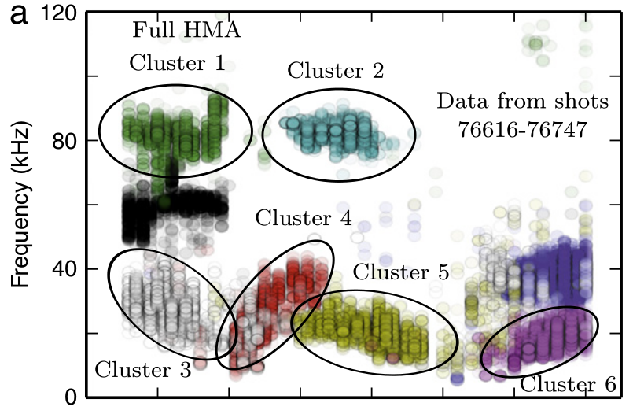
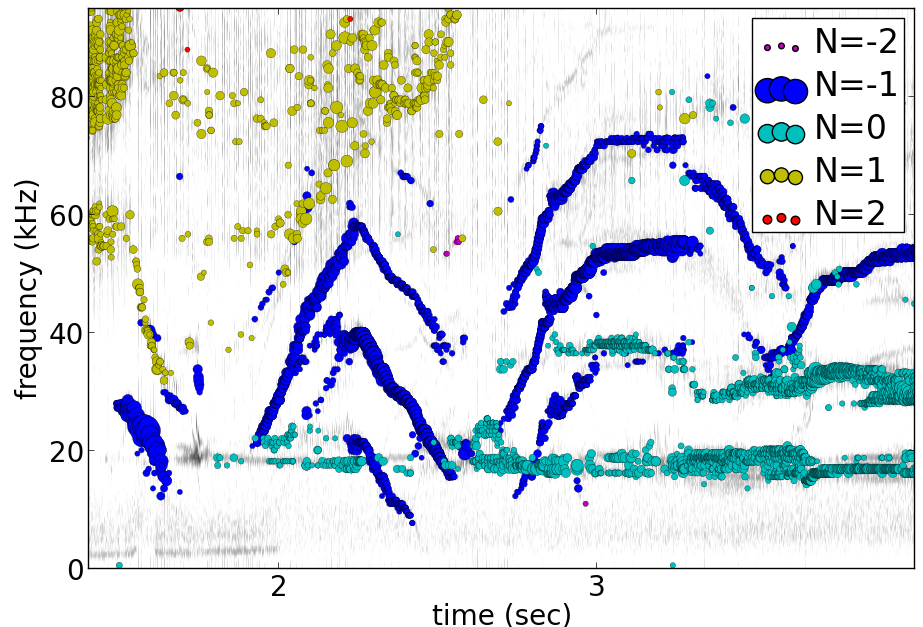

# pyfusion
## python code for data mining plasma fluctuations
This is my fork of David Pretty's original pyfusion code, with much input 
recently from Shaun Haskey 
(https://github.com/bdb112/pyfusion).   

For python 2, release >205b21 is recommended use with the tutorial article in JSPS 2015, although newer releases should also work.
A later release is recommended for python 3.
To run the examples therein, install the files from the zip or the git repository anywhere, and run
<pre><code>
source pyfusion/run_tutorial
</code></pre>
This will add the pyfusion path to your PYTHONPATH, and cd to the JSPS_tutorial directory.
## Datamining Applications in Plasma Physics.
High temperature plasma has many sources of magnetic and kinetic energy, which can drive instabilities.  These may disrupt the plasma, damage components in the plasma vessel, or at best waste energy, reducing efficiency.  Achieving efficient, economic fusion power requires that these instabilities be understood, and with this knowledge, controlled or suppressed.
### What are the objectives?
<pre><list>
	1/ Identify the physical nature of plasma modes - oscillations or fluctuations
	2/ Distill large data sets describing these into a data base of a manageable size.
	3/ With this knowledge, develop means of automatically classifying and identifying these modes.
</list><pre>
Datamining helps with all these aims, especially in automating the process.  This enables the use of large datasets from the entire operational life of many plasma confinement devices, well beyond the capability of analysis by hand.  Ultimately this will enable near real-time identification of modes for control and feedback.
### What are the modes of interest?
By plasma modes we mean plasma oscillations which will usually be incoherent to some extent , because plasma parameters such as density vary in time and in space.  If we can measure the frequency, and its dependence on plasma parameters, we can have some idea of the plasma wave associated with it.  It is better still if we can learn something about the wavelength, or more generally the k vector, so we can in essence measure a point on the dispersion relation of the underlying wave.  Typical modes are drift wave oscillations and Alfvén instabilities. Modes may be driven for example by ideal or resistive MHD instabilities, or by transfer of energy from fast particles, especially if the particle velocity is related to the wave velocity such that a resonant interaction occurs.  The extraction of wavelength information implies the existence of more than one channel of data, so this paper is focussed on analysis of multi-channel time-series data.  

Example clustering showing Alfvenic scaling in the H-1 heliac.

Example of mode identification in the LHD Heliotron at the National Institute of Fusion Science, Toki.
### Relevant publications include:
<pre><list><small>
D. G. Pretty and B. D. Blackwell.   Comp. Phys. Comm., 2009. http://dx.doi.org/10.1016/j.cpc.2009.05.003 and thesis 
SR Haskey, BD Blackwell, DG Pretty, Comp. Phys. Comm. 185 (6), 1669-1680, http://dx.doi.org/10.1016/j.cpc.2014.03.008 and thesis
</small></list></pre>
