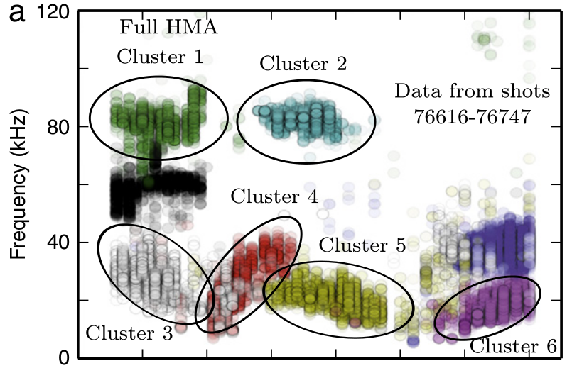
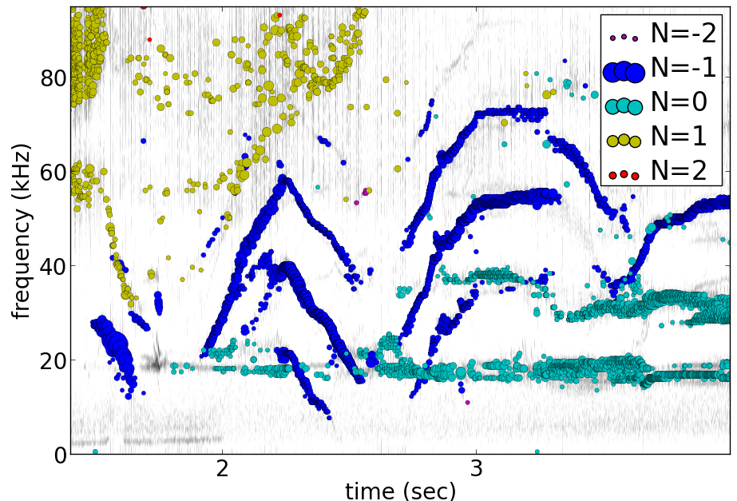

# pyfusion
## python code for data mining plasma fluctuations

Update: Version 0.58 now supports the full set of examples in the JSPF tutorial article, and includes the data files (in downsampled form).  All will run in the download package, apart from two marked (*) requiring access to full databases.

<pre>
example1.py
example1a.py
example1_LHD.py*
example2.py*
example3.py
example4.py
example5.py
example6.py
</pre>

## JSPF tutorial
A tutorial article will appear soon in http://www.jspf.or.jp/eng/jpfr_contents.html (in Japanese) and will be posted on the H-1 heliac website in english, along with full documentation of pyfusion (now at http://people.physics.anu.edu.au/~bdb112/pyfusion/).  In time, the latest docs will be automatically generated on readthedocs.org.

To run the examples therein, install the files from the zip or the git repository anywhere, and do
<pre><code>
source pyfusion/run_tutorial     # or wherever you installed it
</code></pre>
This will add the pyfusion path to your PYTHONPATH, and cd to the JSPF_tutorial directory, and put you into ipython.  Then try
<pre><code>
In [1]: run example4.py
</code></pre>

## Pyfusion code
This is my fork of David Pretty's original pyfusion code, with much input 
recently from Shaun Haskey.  The code runs in 2.6+ and most of the code is compatible with python 3.3+.(https://github.com/bdb112/pyfusion).   The 'six' module is required for both pythons for commits >= fb757c75 

For python 2, release >205b21 is recommended use with the tutorial article in JSPF 2015, although all later releases should also work.
The latest release is recommended for python 3.  

## Quick Installation
Install the default anaconda or canopy python environment for python 3.  For anaconda, add
<pre><code>
conda install scikit-learn
</code></pre>

For more details see
<pre><code>
http://people.physics.anu.edu.au/~bdb112/pyfusion/tutorial/install/index.html
</code></pre>


## Extract from the Tutorial Article "Datamining Applications in Plasma Physics"
High temperature plasma has many sources of magnetic and kinetic energy, which can drive instabilities.  These may disrupt the plasma, damage components in the plasma vessel, or at best waste energy, reducing efficiency.  Achieving efficient, economic fusion power requires that these instabilities be understood, and with this knowledge, controlled or suppressed.
### What are the objectives?
<pre><list>
	1/ Identify the physical nature of plasma modes - oscillations or fluctuations
	2/ Distill large data sets describing these into a data base of a manageable size.
	3/ With this knowledge, develop means of automatically classifying and identifying these modes.
</list><pre>
Datamining helps with all these aims, especially in automating the process.  This enables the use of large datasets from the entire operational life of many plasma confinement devices, well beyond the capability of analysis by hand.  Ultimately this will enable near real-time identification of modes for control and feedback.
### What are the modes of interest?
By plasma modes we mean plasma oscillations which will usually be incoherent to some extent , because plasma parameters such as density vary in time and in space.  If we can measure the frequency, and its dependence on plasma parameters, we can have some idea of the plasma wave associated with it.  It is better still if we can learn something about the wavelength, or more generally the k vector, so we can in essence measure a point on the dispersion relation of the underlying wave.  Typical modes are drift wave oscillations and Alfvén instabilities. Modes may be driven for example by ideal or resistive MHD instabilities, or by transfer of energy from fast particles, especially if the particle velocity is related to the wave velocity such that a resonant interaction occurs.  The extraction of wavelength information implies the existence of more than one channel of data, so this paper is focussed on analysis of multi-channel time-series data.  

## Installation notes
Note that the "source" command is used above because it is necessary to set some environment variables, and simply running a script will not - any environemnt changes are discarded.  Also, although these examples work with straight python, ipython is recommended because of the ease of inspectin variable, debugging, and recalling history.  Features include the use of ? for help informatin and tabbing to see possible completions.  More advanved features can be enabled by settings in ~/ipython/profile_default/ipython_config.py, such as automatically supplying parentheses, automatically reloading imported modules if they are edited.

In the spirit of the version control package 'git', the user is encouraged to work in the source directory structure.  If git is used, the source files are safe, and you can easily see the changes you have made.  This requires that the user has write permission ford this directory, which happens by default if you clone the repository.  
<pre><code>
```python
git clone /home/bdb112/pyfusion/mon121210/pyfusion/
cd pyfusion
</code><pre>
If you don't have write permission, many of the examples will not complete.  <code>git diff </code> will show your changes, but if you want to run previous versions, casual users of git should note that <code>git checkout </code> will silently overwrite any changes you have made to files that came from the repository, so you should use <code>git stash </code> to save your current work, or make another clone.

## Example output
<a href="" target="_blank"></a>

Example clustering showing Alfvenic scaling in the H-1 heliac.

<a href="" target="_blank"></a>

Example of mode identification in the LHD Heliotron at the National Institute of Fusion Science, Toki.
### Relevant publications include:
<pre><list><small>
D. G. Pretty and B. D. Blackwell.   Comp. Phys. Comm., 2009. http://dx.doi.org/10.1016/j.cpc.2009.05.003 and thesis 
SR Haskey, BD Blackwell, DG Pretty, Comp. Phys. Comm. 185 (6), 1669-1680, http://dx.doi.org/10.1016/j.cpc.2014.03.008 and thesis
</small></list></pre>
