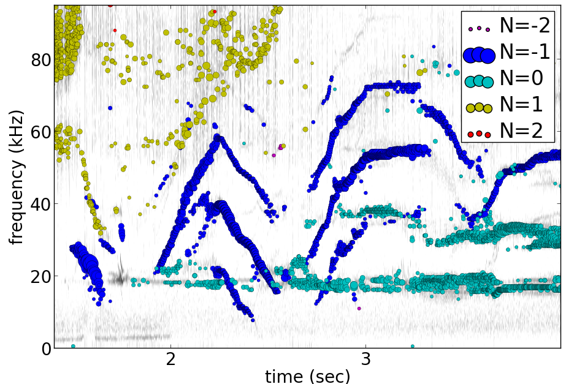

pyfusion - python code for data mining plasma fluctuations
----------------------------------------------------------

 * python3 - basically OK - some problems 20170817:
   - python3 stops after one set of data in process_swept_Langmuir
   - unicode problem in reading cached data (even self generated) - try np.load(encoding='ASCII'
   
 *  Bug! 20160824  save of a file already in local cache (e.g. to decimate) seems to square gains.  Partial fix - don't allow local_saves from local cache (only works on machines with acccess to the archivedB. F further problem to the above workaround - RAW  to be enforced independently of pyfusion.RAW, otherwise pyfusion.RAW is set (to 1) after any save_local - for now, just save in a separate process.
 * possible problem with tests - new convention to return None for data not found may suppress real errors, making tests look too good
 * wid_specgram memory error for foverlap>0

 To see VERSION along with commit index  

.. code-block::

   git log -p pyfusion/version.py |egrep  "\+VERSION =|commit"

Most recent update: 
 * 0.995 Op1.2b
 * more options in plot_fs_DA.py
 * dat/base.py - add the config_name attrib (blank), explanation in config.rst
 * find_cluster_members.py - add a function get_probe_angles - a bit kludgey?
 * merge_test_pyfusion.py - add glob expansion
 * plot_xy.py allow arbitrary timebase
 * sp.py allow collections control to switch points on and off (def on(colls), etc)

 * add service examples in acq/W7X, add threed_aspect, SOL_distance.py

Version 0.995b Op1.2b: 

 * debug on t440p
 * fits.py - include a sum of exponential (double exp)
 * include Lukas PickledAssistant - this required path changes in several profile plots
 * write_LP_as_CSV.py: include area and other indirect paramters in the json form
 * extra_limiter_coords - put centre line in saved json file

  
Version 0.995a Op1.2b: 

 * W7X/fetch.py Lots of fixes and checks for fetch - used to assume trace started at zero time - fixing this required a number of changes to the heuristic fixup code.  The main such change is in code to 'fix' the sq-wave effect, which is now understood to be a precsion problem due to not very smart dealing with absolute times in ns and Nan times.
 * Finally more argument consistency checking, rename some times to make the definition clearer.
 * Use trigger['1'] but fall back to trigger ['0'] if 1 is missing but not in all places. Need to replaced all '61' with a function call.
 * Improve the timeout strategy - the data access is about 1/3rd the time of the JSON conversion,
    - improve strategy for long data segments by getting the json data first, then do the conversion
    - no need for a timeout in the conversion stage, and the timeout will be shorter and so detected faster
 * W7M/fetch.py: integrate time_range and ROI
 * find_shot_times: more comments, checks, importantly we correct the calculation the proportion of time a signal  is above a threshold, given that decimated signal timebases are weird, esp if there is timebase corruption
 * filters: work-around(n_channel fn) for ffts to work in single chan diags, seems to be successful (e.g. check_W7_timebase
 * plot_signals - require a confirmation to use 'old utc' (but only asks if you use run -i) (need to remove 61 sec bit)
 * get_shot_list - much faster for large shot ranges now that shotDA is cached
 * acquisition/base.py: use dist-utils to look at pyfusion version of the saving propram for npz files.
   re-institute sign correction in multi-channel diags. 
   partial workaround for files containing shot_f - more to come
   hardwired 61 sec correction removed but not all of them
 * shot_range - skip from month '13' to next year
 * mini_summary: python 3 print, add MIR4131 series, add peak abs function. fpeak (97th percentil), expands shot_range more correctly, incorporate a cache of multiple actions are perfomed on the same data.
 * plot_svd - W7X example
 * save_to_local - enable pause_while to allow clean pauses, write down the logic, improve logic, debug
 * save_compress
    - carefully create the code to decompress delta encoded times, which used to be prone to severe representational accuracy problems
    - built in accuracy test
 * pyfusion.cfg add MIRno-41_13, MIRNOV_41_13 and fix some other mirnovs
 * check_W7_timebase.py  now works fully AND even for single channel
 * run_process_LP bring more up to date with langmuir_data  - still a funny bug with segments
 * pyfusion.cfg add W7X_L57_U with two copies of LP01_U (and for 53)

 * fixes to get old datamining going - read_text_pyfusion, gen_fs_bands formatted better for long times
 * bin/get_W7X_shotnums more flexible  examples/get_W7X_shotlist.py to find whuch shots for which diags
 * modify.cfg now accesses kain's data, but we are using an equal angle fudge for now 
 * add examples/full_processing_example_script.py
 * find_cluster_members - a really crude cluster finder.
 * visual/nicer_log_axis.py remove some of the clutter in mantissa

 * Add dmusic, plot_dmusic, and add fake coords to W7X_MIRNOV
 * dmusic routine now confirmed against matlab version, and modified to be a more useful subroutine, with debug, plot
 * plot_svd - optional initialisation of buttons returns list of axes for post-manipulation
 * modify.cfg code for fake mirnov cleaned up
 * pyfusion.cfg put fake coordinates in, a couple more collections of mirnov 41

Version 0.993 Op1.2b 
 * Bring in/debug many improvements in W7X fetch and save_to_local (rationalised logic, improved repair)
 * add get_W7X_shot_list (bin and python wrapper)
 * restore cdiff.py
 * mini_summary: improvements for npz only operation, add specgram (pkr4124SPD)
 * Feed back small changes from t440p to big IPP update.
 * modify_cfg.py to make fake 'quasi_toroidal_coords_QXM41'
 * plot_signals and specgram - time_range=[t0, delta] converted to [t0-delta, t+delta]
 * some improved comments
 * plot_specgram - manage titles better for dense multiple plots, add set_clim
 * plots.py:plot_spectrogram - return the axes so that we can access images, clims etc.

 * acquisitions/base: cleanup, better dtclock estimate in the common timebase code 
 * plot_svd - remove  == None and other anachronisms
 * pyfusion.cfg - add plots section - not sure if this is a great idea.

Version 0.993 Op1.2a
 * Fix more examples in test
 * Add examples/check_npz_data_integrity.py
 * Rationalize the check for errors in the timebaseexpr to do with maxint comparison
 * More improvements to deal with different timebases - seems OK!
 * Simple method - use first signal's timebase and cut or nan-pad others
    but only works if signals have utcs - should extend that.

 * Add interpolate_W7X_timebase
 * process_swept_Langnuir - try to detect bad choice of compesation interval
 * plot_DA.py: more info to console
 * plot_LP2D.py: don't error if gas is not available
 * Add multi probe definitions to pyfusion.cfg to separate probes on different timebases, and, to aid in debugging, mix up one probe from different time bases.
 * W7X/fetch.py - allow for self.time_range in do_fetch (not tested), cleanup style, f,t become f_u, t_u
 * acquisition/base.py  add time_range to getdata, using an attribute (self.time_range)
 * remove/rationalise the .t_min and t_max  and t_range from getdata?/plot_signals

666e: merge in IPP changes, but not debugged

Version 0.992 Op1.2b
 * examples/plot_tdu_pflux - makes a page of plots from the  prelim_anal LP data
 * examples/plot_DA_alpha to merge multiple Langmuir runs and plot with alpha according to to error size
 * examples/process_MLP.py - add kludgely overlap feature, bug in initial value of vp
 * data/DA_datamining.py - tidy, verbose=-1 now quietens, add inds to sort plot order and label_fmt to .plot 
 * data/LPextra.py allow trace to work in both leastsq and amoeba, more info msg
 * data/process_swept_Langmuir - delete process_const (not used) remove pcov=None kludge in communicating with LPextra, allow trace to work in both leastsq and amoeba, detect double delays (cycavg, t_offs) add plotDA feature, check filename at start for errors (see parm_dict
 * boxcar - optionally process time (tim=) as well to allow sampling scope effect.
 * visual/window_manager.py much improved - can place windows in a grid, will deal withwindows than just have numbers. (order...) Also list matching windows

 * fetch.py - fix minus typ MDSplus test shot
 * examples/plot_signals.py warning about use of previous utc - probably should remove feature!
 * pyfusion.cfg remove redundant BRIDGE_V1, add BRIDGE_ALLI
 * save_to_local - more info, comments
 * process_MLP, boxcar - add time option, crude overlap of fit data, better operation with time_range/ROI

Version 0.991 Op1.2b
 * Add expr to pyfusion.cfg for simple single argument arbitrary
     functions, remove old unused sgn code in single diagnostic
     (previous minor version didn't integrate gain and expr and RAW)
 * Add examples/process_MLP, plot_xy
 * Implements MDSplus test shots (two shot digs - YYMMDDSS), also in save_to_local
     change pyfusion numbering of MDSplus test shots to negative (and 0)
 * Allow for thin MDS path setting, smarter ROI, skip valid_since for MDSplus
 * Fixes, clarification for process_swept_Langmuir, clean up boxcar
     change numbering of MDSplus test shots to negative (and 0)
 * Add process_MLP
 * pyfusion.cfg - add MLP_I, U, TE, VF, I, ERR also extra BRIDGE with valid_since

Version 0.99    git 21356efd
 * process_swept_Langmuir - add electron saturation finder: find_sat_level
   update get_LP_data.py with window selection, raise etc, use to develop esat finder
   protect find_sat_level which is only for a single channel so far
   recognise vsweep from PARLOG, update run_process_TDLP
 * get_shot_list: add selshot keyword
 * get_url_parms - add check for null dict input to flatten_dict 
   otherwise traceback fails.  Also warn about dual values for gain in minvera channels
 * print_dict_tree - examples
 * utils - wait for confirmation, boxcar average
 * add bridge probe, NBI_1 to pyfusion.cfg

Version 0.99 alpha - adapt process_Langmuir to bridge probe data
 * data/process_swept_Langmuir.py add comments, allow skipping compensation, t_offs to shift the voltage sweep in time, add clip_vprobe
 * also add boxcar.py and mini_summary_MAGPIEII 

Version 0.99 beta - Add W7X MDSplus support (W7M)  to pyfusion
 * this is a good example of what needs to be created.  Takes a few hours only.
 * adds	 pyfusion/acquisition/W7M/__init__.py
	 pyfusion/acquisition/W7M/acq.py
	 pyfusion/acquisition/W7M/fetch.py
	 pyfusion/devices/W7M/__init__.py
	 pyfusion/devices/W7M/device.py
 *  acquisition/base.py define a constant CONTINUE_PAST_EXCEPTION to control stopping in fetches
 * save_compress/newload - return info about data types if verbose
 *  save_to_local - adapt to W7M and rationalise? the conflicting time arguments test.

Version 0.98 alpha - Small fixes, extra diagnostics
 * pyfusion.cfg, fetch allow_reduction keyword to avoid cadoc bug in reduction
 * get_url_parms
    - control result if not found (e.g. None, error), better error messages
	- find appropriate power supply voltage if no voltage monitor
 * shot_range - allow a single shot argument, start working on iterator/generator
 * mini_summary for W7X - start with rought scaper currents.
 * sql_plot.py generalise to other databases
 * config.sys - add NBI and scraper

Version 0.98 beta - Finalise doing get_signal_path better, and fix multi plots will missing data. Also add MIRNOV_11 and MIRNOV_41, , W7X_NBI and fix ECH
 * get_signal_path now recognises time period of shot
 * W7X/fetch.py - add
   Rf,MainCoils,ControlCoils,TrimCoils,Mirnov,InterfER,_NBI_' to the
   list which get processed by using views/KKS url look up, add
   error_info(), hardwire in the split to two PCS CDS=26417
 * W7X/get_shot_info - define shot 0 to have a time of 0 time on that day and >=999 to time zero the next day - this allows valid_since to work on utcs instead of shots
 * acq/base.py: allow plots of multi diags to preceed with Null data on same channels. Remove W7X dependency on valid_since, convert valid_since to use utcs in comparison, but shot numbers in config file
 * dat/utils.make_title - don't use the device part of the channel name in ylabels
 * plot_shots - try to make plot figures pop up as they go - no effect on PC
 * print_dict_tree - save file to temp, allow exclusion of names
 * save_to_local - pause for confirmation if NSAMPLES is not zero
 * pyfusion.cfg - add mirnovs, nbi, and corrections/updates as above
 * H1/scrape_wiki.py get_links returns None for page not found, [] if no links
 * shot_range - add inc= argument
 * examples/calibrate_probes.py 0 beginning of script to check probe calibration

Version 0.97 alpha -  Fix the dodgy channel fix in previous attempt, tidy the new config
  * add level limit to flatten_dict

Version 0.97 alpha -  Integrate LP diagnostic set for OP1.2b commissioning
 * pyfusion.cfg and get_url_parms (fix dodgy voltage channel hack)

Version 0.96 alpha -  python 3 fixes mainly, also
 * get_url_params: add flatten_dict to allow for print_dict
 * python3 fixes using six. including test_examples, and the test examples
 * also remove some duplicate lines in pyfusion.cfg

Version 0.95 alpha -  Prepare to merge with W7X copy of 2017, to allow adding of 2018 changes
 * no changes needed so far for MAGPIE outside pyfusion.cfg
 * W7X/get_shot_list.py warn if the date is later than the maximum date scanned
 * process_swept_Langmuir.py - make comp of all channels accessible in self.comp
        allow leakage to be input for the whole array, smarter default sweep
 * pyfusion.cfg - add some MAGPIE diags

Version 0.94 beta -  prepare for adding MAGPIEII npz support (localdata only)
 * a few improved comments
 * mirnov_RMS_db - back up db uniquely
 * sql_plot.py - better comments, help, and allow for 'bad' int data

Version 0.93 beta -  improvements to handling probe cross-talk and someother smaller changes
 * get_url parms: rs_used = rs*1.0  # save rs_used in npz so we can track correction method
 * acquisiton.base.py:  important to make sure channel mapping is the same
 * clustering.py: crude component plot (not corrected for corrds relative to boozer)
 * replace tupleshot with code using convenience.is_listlike()
 * plot_shots:  for W7X, add shot details to plot based on UTC
 * pyfusion.cfg: add LPTENI (LP 10 I)
 * W7X.get_shot_list - clean up to PEP, add selectable shot times
 * test_examples.py - improvements, and deal getdata with returning None add contin= arg to getdata

Version 0.92 beta -  a few fine-tuning fixes
 * process_swept_Langmuir/extra careful delete of harmonics, add DC conductance output
 * check_W7X_timebase_repair - improved auto freq, allow for rounding in reduce_time
 * improve test_examples, fix a few - now 79 good, 26 errors
 * kill bug for single _U channels in get_url_parms
 * step plot, overplot instructions in DA_datamining
 * bring lasso example/utils up to date
 
Version 0.91 beta -  W7X manos, current fixes, mini_summary, standalone_events
 * find_shot_times - optimise - use raw data to allow for 1 and 10 ohm, iterate level, test list in __main__
 * get_shot_list - add get_standalone
 * acquisition/base.py add params to outputdata so we can retrieve gain_used - but really want Rs
 * save_compress - bug foxed in maxerr
 * examples/mini_summary  adapt for W7X, a few fixes
 * save to local some fixes in find_kws, record a short seg anyway of no threshold found
 * pyfusion.cfg - add seral manometers AEH11,21,31,41, AEI30, also changes to coils, trim - why?
 * time_utils.py  - more general, more formats auto detected

Version 0.90 beta - significant improvements for W7X
 * re-enable pyfusion.COLORS, including initializing form env var
 * ad8d+: means changes including form ad8d
 * ad8d+: big improvements to find_shot_times - use minmax reduction, auto-threshold, ignore spikes
 * get_url_params - fudge +1 ohm gain correction
 * better harmonic testing in LPextra
 * process_swept_Langmuir - clean up vsweep access, allow a sinlge (non multi) diag.
 * check_W7X_timebase_repair - use a nice FFT size
 * utils/time_utils - many more formats auto detected, add utc_GMT (inverse transform)
 * ad8d+ fetch.py ControCoils and TrimCoils included in auto url
 * ad8d+ get_shot_list - works with and without cache
 * ad8d+ acquisition/base - include cal_date, comment
 * ad8d+ Add Ctl, IP, WDIA to minisummary
 * ad8d+ fix TrimCoils, add ControlCoils to pyfusion.cfg

Version 0.89 beta
 * W7X/fetch.py, base.py - return error reason via self.errmsg
 * W7X/find_shot_times.py add debug info, plot, fix exception logic, make part compatible with cached da ta (diff_dimraw)
 * show_valid_times - put comment and data on the bar plot
 * acquisition/base.py - as above, and add exceptions kwd to getdata
 * data/plots.py spegram - deal with integer and float noverlap
 * save_to_local.py - implement find_shot_times, improve exception handling

Version 0.88 beta
 * This also adds HeliotronJ updates - BES1 to pyfusion.cfg and updates to libfdata.c
 * show_valid_times (for PARMLOGs)
 * then in previous save, (previous README was not updated)
 * W7X/fetch now returns times wrt tzero of 61 sec (via trigger['1']), and only starts at 'pre_trig-secs' before
 * W7X/get_shot_list.py  add get_shot_number (form utcs)
 * DA_datamining (cleaner check of dict/obj type, ref zero line for Vf)
 * data/process_swept_Langmuir.py - adjust voltage sweep default according to shot
 * examples/W7X_neTe_profile.py - plot TDU data
 * modify_cfg.py - read in Michael Endler's probe data file, so coords are real
 * process_TDLP - defaults for sweepV
 * sql_plot - line and marker colors more sensible order - also fiddle with use of Nans
 * fits.py - was missing for a while, used for biexp fits in process_Langmuir

Version 0.87 beta
 * W7X/fetch.py can return raw timebase in integer ns (repair=-1)
 * fix bugs in get_url_parms (numbers cancelled, so bu not evident on LP)
 * also added cal_info data recording source of calibration (Minerva)
 * data/base - return None for bad data - also in plot_shots etc
            full_scale attribute causes data outside 2* full scale to be hidden
 * data/plots - add rough multi diagnotic plot to spectrogram
 * add grouped_shots facility to sql plot and plot_shots
 * save_to_local - add option to restrict tie range, also worked arounf save not RAW bug - need to fix using a separate save_in_RAW variable
 * Many fixes to pyfusion.cfg importantly using get links to resolve human readable address into actual address
 * koords, area still not real values

Version 0.86 beta
 * more implementation of the smarter way (ECH, Main, Trim) - in W7X/fetch.py - now all those three work for op1.1 and 1.2a (with one or two exceptions), but timebase funny on multi-diag plots of ECH

 * data/base.py - return None for an inacessible channel, unless DEBUG>2
 * some more fixes above - version is the same

 * incorporate lukas' py3 changes - but the signalexpr fix is not yet carefully tested
 * many other small py3 fixes

Version 0.85 beta

 * Many fixes or skip to improve test successes
 * test_examples - add stop on error, restart at stop point, script as well as skip, accepts first arg without equals
 * Add pyfusion.GL - global list for saving stuff to, e.g. results of mltiple runs of a script, e.g. using runpy
 * runpy_cmd enhanced to allow substitution, and results of multiple runs (scans) to be saved 
 * acquisition/base.py suggest similar names if diagnostic section not found
 * add corrinterp (correlation following interpolation) pyfusion_corrinterp
 * plot_correlation -  add filter, channel mask
 * extended function of corrinterp and pyfusion_corrinterp to include freq
 * data/filters/get_optimum_time_range.py to avoid error on small samples
 * shot_range.py - simplify test of tuple or scalar
 * signal_processing.py python3 cleanup (not tested on p3)
 * W7X_neTe_profile.py add 'pub' options
 * coherence_vs_time generalise, shade 'dodgy region'
 * get_diamag - improved, also extra care to find pulse
 * plot_shots.py auto row/col
 * sql_plot lots - add colors, markers, swap axes, improved tolerance of null, Nan
 * process_cmd_line_args_code.py - fix bug with locals

Version 0.84 beta

 * add H-1 wiki functions - scrape_wiki and wiki_days_db to connect
   wiki and summary db to a degree
 * acquisition/base extract valid_for_shot logic into a function: update_with_valid_config()
 * data/base: fixed bug in MetaMethods which failed to transfer  __doc__ to filters.
 * data/filters: make RMS the default - variance is not a good normaliser, pass on norm params, some care with copy=
 * data/plots: some misc fixes and fixes on angle name, add time offset t0
 * JSPS_tutorial/examples/cross_phase: fix incorrect indexing now total phase is first
 * check_W7X_timebase_repair - improvements
 * correct_LP_data.py - try to include the various changes to config with date not tested much
 * examples/cross_phase: bring in most of the features from the JSPS longer version   
 * examples/plot_both_LP2D.py: make  'not enough frames' error clearer, and tolerate missing gas data
 * examples/plot_signals: add time offset t0
 * examples/plot_svd: AngName,  add some test cases at top
 * save_to_local prevent abort of a multi channel if one is missing
 * pyfusion.cfg - W7X modifications back to the 18 Jan
 * pyfusion_boyd_nov_2012: add coord data to mirnov 
 * test_examples: alphabetical order is default (filename[-1], incl
   case), fixed bug when @SKIP encountered
 
Version 0.83 beta

 * acquistion/base.py fix tmp_data bug, respects valid_dates when called with utc_ns args
 * save_to_local names log files more clearly, and stores as a dict.
 * some __doc__ improvements

Version 0.82 beta

 * W7X/fetch.py kludge to fixed spikes in scaled data, partially implement nSamples,
 * add get_programs to get_shot_list.py
 * data/base.py  fix bug in compare shot (force tuples)

Version 0.81 beta

 * many __doc__ edits and formatting on the doc files in http://people.physics.anu.edu.au/~bdb112/pyfusion/
 * W7X/fetch.py %% py3 compat fix, use cygwin if there for wget
 * data/base.py has a fudge to reenable use of [utc,utc] in place of [date,shot]
 * manage_data.py replaces filesorter.py

Version 0.8 beta

 * valid_dates changed to valid shots - more flexible
 * 'updated' or inherited methods such as data.plot_signals now have
   their correct __doc__ strings (e.g. for ? help() dir(s)
   information) - in plots/base.py
 * DA_datamining - method to make dictionary items also attributes
 * data/base.py - transfer __doc__ to new 'updated' function in MetaMethods
 * data/convenience.py add inlist and inds_from_list to allow lists in
   where clauses
 * data/process_swept_Langmuir - add freq arg, adapt shot to work with
   simple and two component shot numbers.
 * save_compress - exetend fix for obscure nan rubbish data bug
 * mini_summary_MDS - implement creation of attributes for each
   element (array) in the result of a query
 * pyfusion.cfg  change valid_dates to valid_shots

Version 0.7.9.beta

* fixups in W7X/fetch and W7X_read_json

Version 0.7.8.beta

* include raw dimension utcs in data.params - can be used to try to recontruct bad time vectors.
* save_compress py3, save_to_local - save logs as json.
* document valid_dates
* many impronements to W7X_neTe_profile, cmd_line, Pdsmooth, median, compensation, profile fits
* also plot_both_LP2D.py
* mini_summary includes text and MDS version
* pyfusion.cfg - add more valid_dates, and add individual ECH chans
* W7X_read_json - for testing url reads off line

Version 0.7.7 alpha

* Add a valid_dates feature to base.py so that pyfusion.cfg can have
  changes to parameters for specific date ranges.
* implement for L53_LP05-12 - need to do converse for LP_U
* Also simple check that params['DMD'] is consistent between npz.file
  and pyfusion.cfg
* add no_cache option to getdata so that the local cache can be
  avoided, (activate by save_compress=0 in save to_local for now)

Version 0.7.6 alpha

* change W7X shot to a tuple (reason for calling an alpha)
* debug some error messages in W7X
* fix images in README.rst
* make the feedback about which shotDA file is used only print for VERBOSE>0
* fix units and magnitude error in puff_db
* integrate filter function had a confused baseline removal - now fixed and allows for constant and slope removal
* added hold=2 option to plot_signals.py to put such data on a second y axis 
  (also in data/plots allow plotting a single channel on an existing axis for overplotting etc)
* converted mini_summary to use pure pyfusion
* improvements to plot_both_LP2D, debug weighted averaging
* get_shot_list - info messages suppressed unless VREBOSE>0
* acq/data/base - keep track of data source (source via acq.source) in params 
* several Langmuir file - change Vp to Vf
* N2_puff_correlation - move ECH to a twin axis, improve limit
  setting
* extract_limiter_coords - extract limiter profile in midplane, include node index list

See below for previous updates

Pyfusion code
-------------

This is my fork of David Pretty's original pyfusion code, with much
input recently from Shaun Haskey. The code runs in 2.6+ and most of the
code is compatible with python
3.3+.(https://github.com/bdb112/pyfusion). The 'six' module is required
for both pythons for commits >= fb757c75

For python 2, release >205b21 is recommended use with the tutorial
article in JSPF 2015, although all later releases should also work. The
latest release is recommended for python 3.

JSPF tutorial
-------------

A tutorial article will appear soon in
http://www.jspf.or.jp/eng/jpfr\_contents.html (in Japanese) and will be
posted on the H-1 heliac website in english, along with full
documentation of pyfusion (now at
http://people.physics.anu.edu.au/~bdb112/pyfusion/). In time, the latest
docs will be automatically generated on readthedocs.org.

To run the examples therein, install the files from the zip or the git
repository anywhere, and do

.. raw:: html

   <pre><code>
   source pyfusion/run_tutorial     # or wherever you installed it
   </code></pre>

This will add the pyfusion path to your PYTHONPATH, and cd to the
JSPF\_tutorial directory, and put you into ipython. Then try

.. raw:: html

   <pre><code>
   In [1]: run example4.py
   </code></pre>

Quick Installation
------------------

Install the default anaconda or canopy python environment for python 3.
For anaconda, add

.. raw:: html

   <pre><code>
   conda install scikit-learn
   </code></pre>

For more details see

.. raw:: html

   <pre><code>
   http://people.physics.anu.edu.au/~bdb112/pyfusion/tutorial/install/index.html
   </code></pre>

Extract from the Tutorial Article "Datamining Applications in Plasma Physics"
-----------------------------------------------------------------------------

High temperature plasma has many sources of magnetic and kinetic energy,
which can drive instabilities. These may disrupt the plasma, damage
components in the plasma vessel, or at best waste energy, reducing
efficiency. Achieving efficient, economic fusion power requires that
these instabilities be understood, and with this knowledge, controlled
or suppressed.

**What are the objectives?**:

1. Identify the physical nature of plasma modes - oscillations or fluctuations
2. Distill large data sets describing these into a data base of a manageable size.
3. With this knowledge, develop means of automatically classifying and identifying these modes.

Datamining helps with all these aims, especially in automating the process.  This enables the use of large datasets from the entire operational life of many plasma confinement devices, well beyond the capability of analysis by hand.  Ultimately this will enable near real-time identification of modes for control and feedback.

**What are the modes of interest?**:
By plasma modes we mean plasma oscillations which will usually be incoherent to some extent , because plasma parameters such as density vary in time and in space.  If we can measure the frequency, and its dependence on plasma parameters, we can have some idea of the plasma wave associated with it.  It is better still if we can learn something about the wavelength, or more generally the k vector, so we can in essence measure a point on the dispersion relation of the underlying wave.  Typical modes are drift wave oscillations and Alfvén instabilities. Modes may be driven for example by ideal or resistive MHD instabilities, or by transfer of energy from fast particles, especially if the particle velocity is related to the wave velocity such that a resonant interaction occurs.  The extraction of wavelength information implies the existence of more than one channel of data, so this paper is focussed on analysis of multi-channel time-series data.  

**Installation notes**:
Note that the "source" command is used above because it is necessary to set some environment variables, and simply running a script will not - any environemnt changes are discarded.  Also, although these examples work with straight python, ipython is recommended because of the ease of inspectin variable, debugging, and recalling history.  Features include the use of ? for help informatin and tabbing to see possible completions.  More advanved features can be enabled by settings in ~/ipython/profile_default/ipython_config.py, such as automatically supplying parentheses, automatically reloading imported modules if they are edited.

In the spirit of the version control package 'git', the user is encouraged to work in the source directory structure.  If git is used, the source files are safe, and you can easily see the changes you have made.  This requires that the user has write permission ford this directory, which happens by default if you clone the repository.  

.. raw:: html

   <pre><code>
   git clone /home/bdb112/pyfusion/mon121210/pyfusion/
   cd pyfusion
   </code></pre>

If you don't have write permission, many of the examples will not complete.  <code>git diff </code> will show your changes, but if you want to run previous versions, casual users of git should note that <code>git checkout </code> will silently overwrite any changes you have made to files that came from the repository, so you should use <code>git stash </code> to save your current work, or make another clone.

Example output
--------------

| Example clustering showing Alfvenic scaling in the H-1 heliac.
|

.. image:: pyfusion/6_good_clusters_CPC.png

| Example of mode identification in the LHD Heliotron at the National Institute of Fusion Science, Toki.
| 

**Relevant publications include:**:

1. D. G. Pretty and B. D. Blackwell.   Comp. Phys. Comm., 2009. http://dx.doi.org/10.1016/j.cpc.2009.05.003 and thesis 
2. SR Haskey, BD Blackwell, DG Pretty, Comp. Phys. Comm. 185 (6), 1669-1680, http://dx.doi.org/10.1016/j.cpc.2014.03.008 and thesis

Previous Updates
----------------

Version 0.7.5 beta 

* integrate doc and update README.rst, eliminate README.md
* get_shot_list - nicer output format
* data/base.py warn if cached data is in a temp dir
* DA_info optional 3rd positional argument - key to examine
* process_Langmuir - rearrange so that mask can be re set by simple paste
* mini_summary - add some more diags
* plot_both_LP2D.py - plot upper and lower segs together, only some
  improvements back ported to plot_LP2D.py
* run_process_LP - changed tcomp to slightly smaller to allow for
  early breakdown
* partial fix of save_to_local - don't allow local_saves from local cache (only works
  on machines with acccess to the archivedB
* save_to_local saves log in a pickle

Version 0.7.4 beta

* delayed MDSplus import to avoid import error for JSPS example1
* several small improvements, incl minpts arg to plot_LP2D.py, generalise run_process_LP,
* tune tests to make more test_examples work, failed attempt to implement timeout in test-examples
* add branch lukas

Version 0.7.3 alpha

* comment fields now included and recognised in pyfusion.cfg files
* pyfusion.cfg space chars in URLS changed from %20 to %%20 for py3
* W7X examples added, including some very short data files for practice/debug
* Add Ie/Ii ratio to dataset (Ie_Ii)
* Adapt DA_datamining to use on h1
* fix bug in mdsplus style paths
* explore alternative corrections to corrupted timebase - but leave suppressed
* centralise access to shotDA.pickle/json
* Test routine (test_examples.py) now only tries file in the git
  repo, optionally newest first
* edit several new example routines to run under test.
* replace inf in JSON write_LP_as_CSV.py some matlab doesn't
  recognize inf?  loadjson.m (mathworks, qianqian fang 2011/09/09
  seems to want to read Inf.

Version 0.7.2: beta

* minor fixes to get working on H-1 data again (shot, config_name,
     config_boyd) implement averaging through lists in plotLP2D

Version 0.7.1: beta

* make 't' the default time variable (if t_zero is given) in Langmuir
  DA files.  't' is derived from t_mid:  t = t_mid - t_zero
* filters.py: now segment() accepts floats for the number of samples,
  allowing the segments to be phase locked to a signal.
* process_swept_Langmuir also.
* N2 puff correlation - generalise and tidy, labelling
* W7X_neTe_profile - fix sign error in 'x' coord
* plot_LP2D  - add acquisition/W7X/puff_db, suppress dodgy ne in
  image, get seg 7 axes right way up.

Version 0.7.0: beta

* process_swept Langmuir 
  threshchan is used to determine start and end of plasma
  residual DC offset removed in get_iprobe
  IO too small used in mask criterion
* plot_LP2D - general improvements
* N2_puff_correlation - choice of physical units or coefficient
* write_LP_as_CSV also writes JSON

Version 0.7.0: alpha

* fixes to leastsq, add error estimates through covariance (leastsq only) and by
  tracking the convergence in time (both amoeba and leastsq)
* also fit has LP filter option and removal of unrelated harmonics
* LP_extra has pre-fit filtering and error estimation
* get_LP_data improvements, filtering etc.
* add hist() function to DA_datamining

Version 0.6.9: beta

* temporary update to avoid too many changes at once
* process_swept_Langmuir includes scipy.optimise.leastsq and some more
  parameters, also tracks the root finder, fixed figure count limiter
  and improved flexibility of saved filename.
* get_LP_data.py pulls the v,i data from a characteristic plot and
  plays with it for algorithm development.
* N2_puff_correlation: add correlation  (coefficient and physical
  units) and Lukas's distance routine.
* add write_LP_as_CSV.py (also JSON)
* add examples/correct_LP_data.py, file_sorter and file_finder_db which allows
  local_data cache to be rationalised
* fix bug in save_compress brought on by corrupted W7X timebase
* Raise Error if data is pre 0.68b
* improve auto filename generation in process_swept_Langmuir
* pyfusion.cfg corrections (delete LP21..)
* fix domain checker to retain result in self.acq
* add mdsplus style path extra_data/to organise shots into folders 
* calc correlation in examples/N2_puff_correlation.py, also lukas probe info including distance to LCFS
* minor fixes to fourier in data/filters.py
* mini_summary.py try speeding up sqlite file form, make less MDSplus dependent
* improvements for plot_LP2D.py

Version 0.6.8: beta

* Corrected limiter swap (3 and 7 interchanged) and several typos.
* Added time plot of diagnostics to plot_LP2D.py
* moved dummysig into data.filters module

Version 0.6.7: alpha

* Corrected Langmuir probe coordinates 11-20, added areas from Tipflachen_boyd.xlsx, added host and incremented npz version to 103 to indicate correct coords.
* examples/N2_puff_correlation.py uses ECH start as time zero
* Add gas controllers, currents including MainCoils, TrimCoils
* Many improvements to process_swept_Langmuir, including actual_params
* Simple test to warn if process is unable to access ipp-hgw, to avoid
  waiting for timeout accessing URL

Version 0.6.6:
 
* restores coordinates coding (incl W7X), transforms not properly implemented yet
* process_swept_Langmuir is more convenient to use (incl auto load and save)
  rest_swp='auto' choose to restore the sweep according to shot number.
* plot_LP2D - animate Te and ne (into pngs)  
* examples/modify_cfg.py is a script to add/modify pyfusion.cfg
  (presently coordinates)
* Some gas controls in pyfusion.cfg
* pyfusion.DBG() instead of pyfusion.DEBUG if a purely numeric value is
  needed (e.g. in > or < tests).  This avoids unwanted debugger breaks when a
  text key is used.
* fixed problem in LHD data access due to exception in LHDConvenience function.  (output_coords)

Version 0.65: Langmuir processsing is separated into two classes/objects (see
data/process_swept_Langmuir), optimised and saved as dictionary of
array (DA) files, with a built in mask of dubious data.
Clipped sweep voltage can be restored by restore_sin()

Issues: 

1. applying restore_sin to data that are not clipped produces
   large errors.
2. partial clipping produces elevated Te
3. fit quality criterion and ne calculation need improvement

**Version 0.64** beta has improved processing of clipped, swept Langmuir probe data,
Next version will have multi-channel data extraction system using pyfusion 'Dictionary of Arrays'.

**Version 0.63 beta** has fixes for multichannel diagnostic local saves,
and convenient entry for large ranges of data and shots.
Initial Langmuir analysis in process_swept_Langmuir, and pyfusion.CACHE to
allow local chaching of json data. (very large!)

pyfusion.reload() to reload configuration - git 5aed of 3-Mar

Version 0.62 alpha includes more timebase checks for W7X, corrected
gains for channels, and saves utc and params with data.

**Version 0.61** includes first working version of W7-X archiveDB
support, without much care for python3 compability of the new code.
beginning support for two component shot number e.g. [20160301,5]

**Best pre W7X Version (0.60) is 09ba5** - supports Python 2/3 for almost all scripts 
(MDSplus is the main problem - see issues) and the full set of examples in the JSPF tutorial article. 
The 4 criteria on the development roadmap have been achieved, and the
five that were postponed until 0.7 are at least partially
implemented.

**Version 0.58** now supports the full set of examples in the JSPF
tutorial article, and includes the data files (in downsampled form). All
will run in the download package, apart from two marked (\*) requiring
access to full databases.

.. raw:: html

   <pre>
   example1.py
   example1a.py
   example1_LHD.py*
   example2.py*
   example3.py
   example4.py
   example5.py
   example6.py
   </pre>

